# Tag-a-Long - Visual Architecture Diagrams

**Interactive Mermaid diagrams explaining the complete system architecture**

> **Note:** These diagrams render in GitHub, VS Code (with Mermaid extension), and other Mermaid-compatible viewers.

---

## Table of Contents

1. [High-Level System Architecture](#1-high-level-system-architecture)
2. [Request Flow (Detailed)](#2-request-flow-detailed)
3. [Authentication Flow](#3-authentication-flow)
4. [Payment & Subscription Flow](#4-payment--subscription-flow)
5. [Database Schema (Entity Relationship)](#5-database-schema-entity-relationship)
6. [Technology Stack](#6-technology-stack)
7. [External Services Integration](#7-external-services-integration)
8. [API Route Map](#8-api-route-map)

---

# 1. High-Level System Architecture

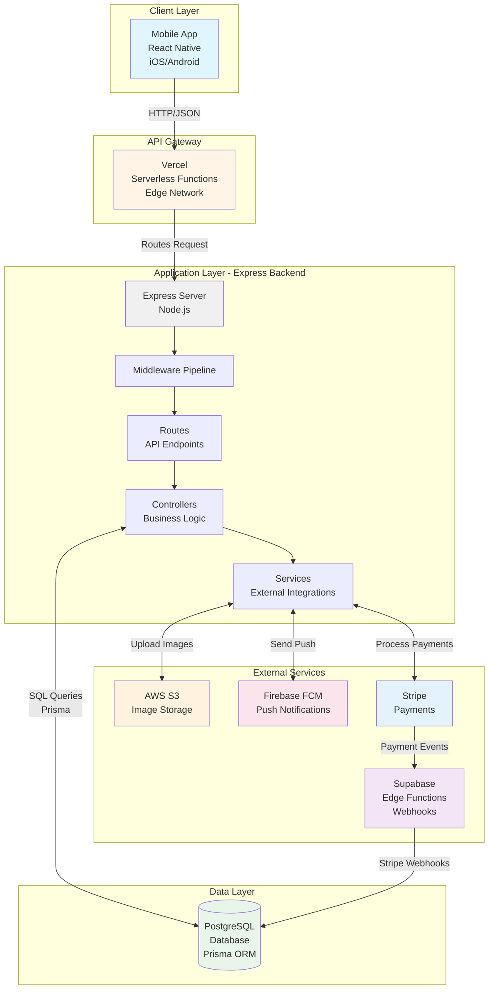

**Key Components:**
- **Mobile App:** React Native (TypeScript)
- **API Gateway:** Vercel serverless deployment
- **Backend:** Express.js (Node.js v18+)
- **Database:** PostgreSQL with Prisma ORM
- **Storage:** AWS S3 for images
- **Notifications:** Firebase Cloud Messaging
- **Payments:** Stripe + Supabase Edge Functions

---

# 2. Request Flow (Detailed)

This shows what happens when a user creates an activity listing.

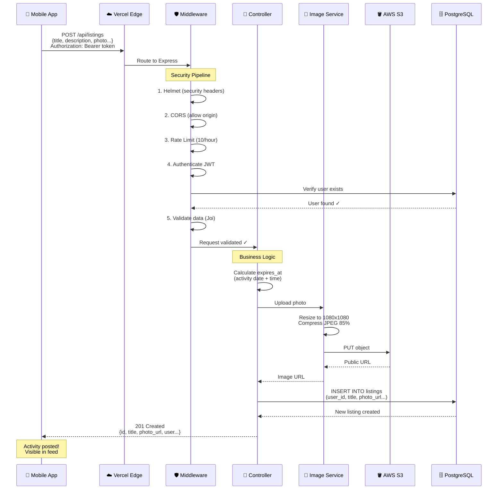

**Timeline:** ~500-1500ms total
- Middleware: 50-100ms
- Image upload: 300-1000ms (largest factor)
- Database insert: 20-50ms
- Response: 10-20ms

---

# 3. Authentication Flow

## Signup Flow

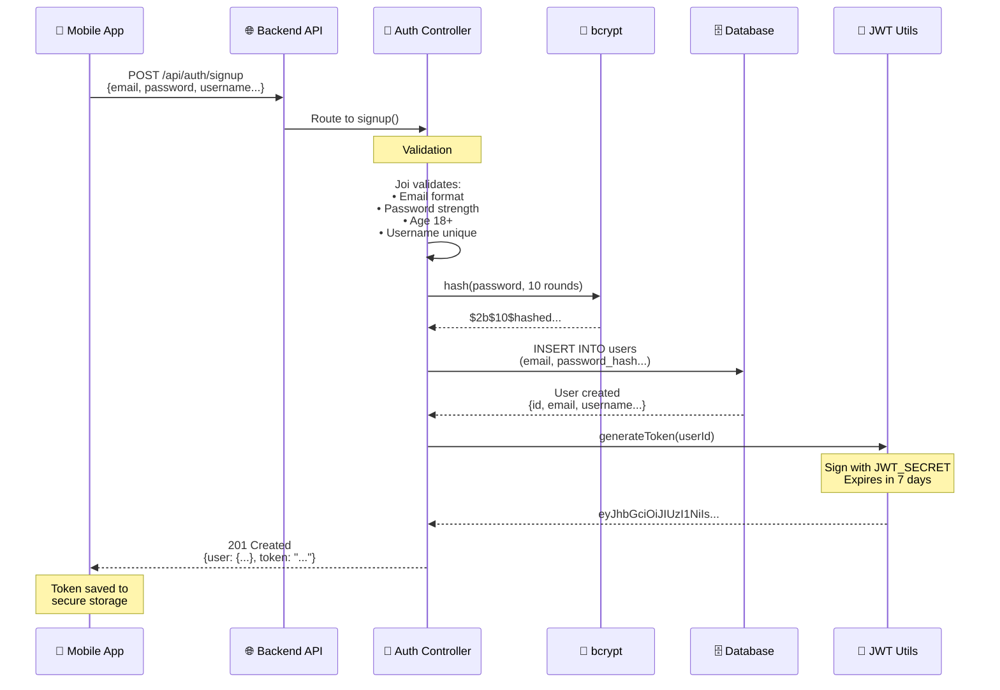

## Login Flow

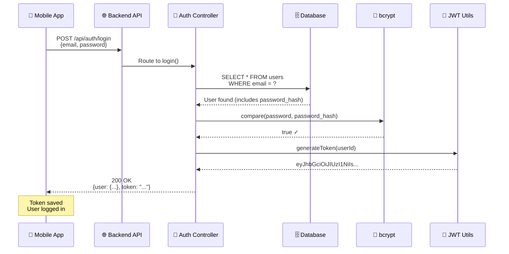

## Token Verification (Every Protected Request)

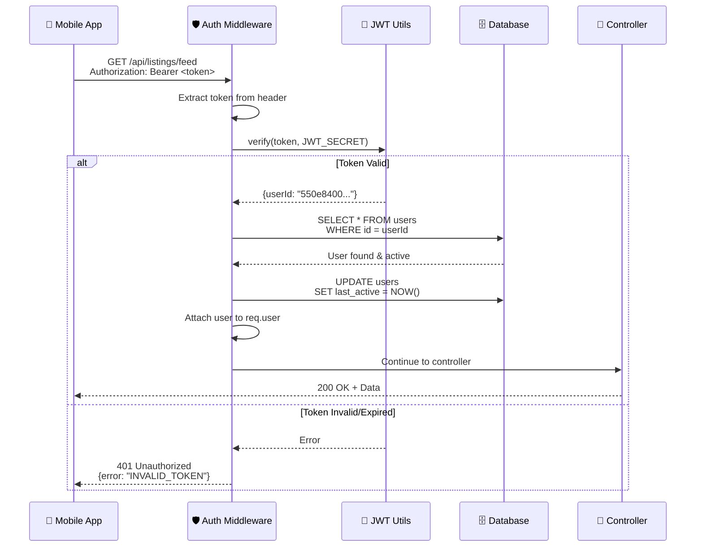

---

# 4. Payment & Subscription Flow

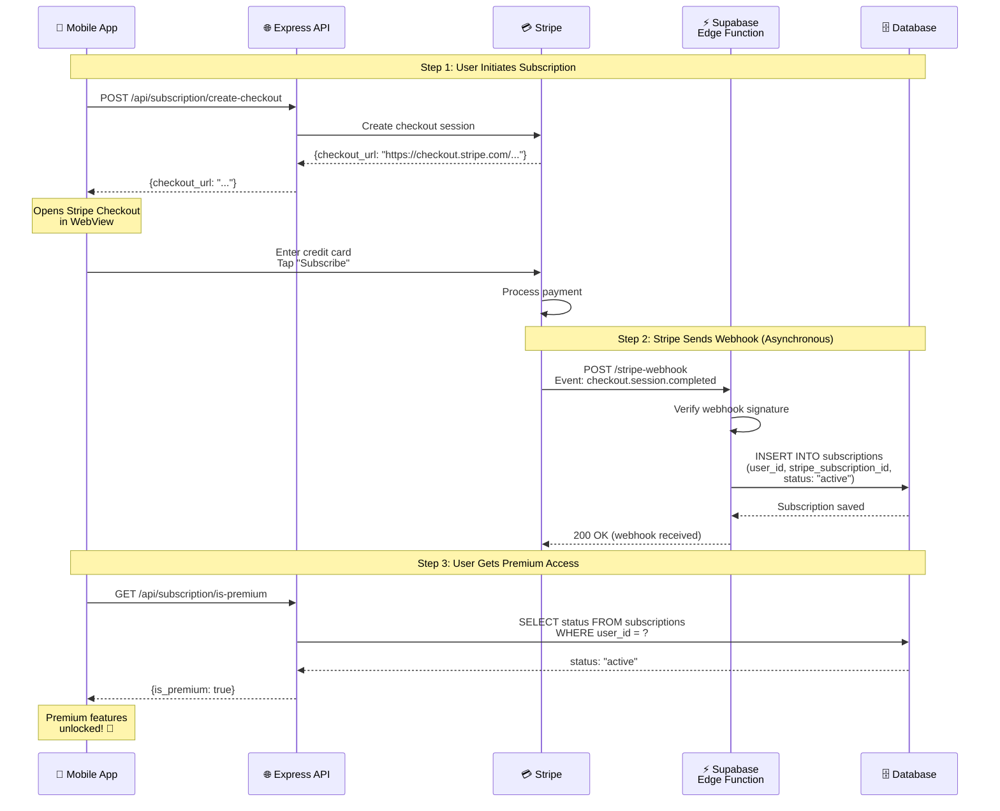

**Critical Path:**
1. **Synchronous:** User → Stripe (payment always works)
2. **Asynchronous:** Stripe → Webhook → Database (can fail!)

**Failure Mode:**
- If webhook fails: User paid but no premium access
- Mitigation: Stripe retries webhooks for 3 days
- Manual fix: Check Stripe dashboard, update DB

---

# 5. Database Schema (Entity Relationship)

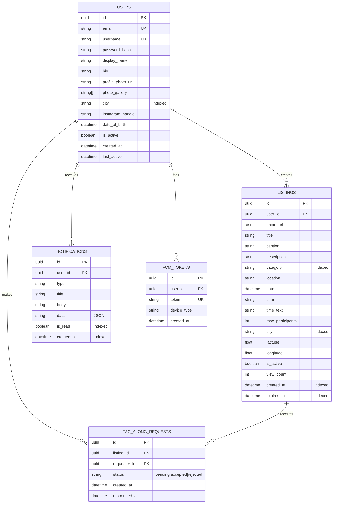

**Key Relationships:**
- **1:N** - One user creates many listings
- **1:N** - One user makes many requests
- **1:N** - One listing receives many requests
- **Unique Constraints:**
  - `[listing_id, requester_id]` - Can't request same activity twice
  - `[user_id, token]` - No duplicate FCM tokens

**Indexes for Performance:**
- `LISTINGS[city, is_active, created_at]` - Fast feed queries
- `NOTIFICATIONS[user_id, is_read, created_at]` - Fast unread count
- `TAG_ALONG_REQUESTS[listing_id, status]` - Fast host view

---

# 6. Technology Stack

```mermaid
graph LR
    subgraph "Frontend"
        A[React Native<br/>TypeScript]
        A1[Expo]
        A2[React Navigation]
    end

    subgraph "Backend Runtime"
        B[Node.js v18+]
        B1[Express.js 4.18]
        B2[JavaScript ES6+]
    end

    subgraph "Database"
        C[PostgreSQL 15+]
        C1[Prisma ORM 5.7]
    end

    subgraph "Cloud Platform"
        D[Vercel<br/>Serverless]
        D1[Supabase<br/>Edge Functions<br/>Deno]
    end

    subgraph "External Services"
        E[AWS S3]
        F[Firebase FCM]
        G[Stripe]
    end

    subgraph "Development Tools"
        H[Git/GitHub]
        I[VS Code]
        J[Postman]
        K[Prisma Studio]
    end

    A --> B
    B --> C
    B --> D
    B --> E
    B --> F
    B --> G
    D --> D1

    style A fill:#61dafb
    style B fill:#68a063
    style C fill:#336791
    style D fill:#000000
    style E fill:#ff9900
    style F fill:#ffca28
    style G fill:#635bff
```

**Language Breakdown:**
- **Frontend:** JavaScript/TypeScript (React Native)
- **Backend:** JavaScript (Node.js)
- **Edge Functions:** TypeScript (Deno)
- **Database:** SQL (via Prisma)
- **Config:** JSON (package.json, vercel.json)
- **Schema:** Prisma Schema Language

**Framework Versions:**
- Node.js: v18+
- Express: 4.18.2
- React Native: Latest (managed by Expo)
- Prisma: 5.7.0

---

# 7. External Services Integration

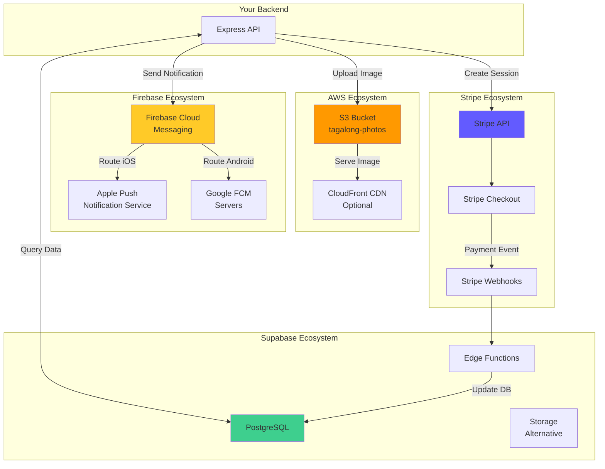

**Data Flows:**
1. **Images:** App → Backend → S3 → CDN → Users
2. **Push:** Backend → Firebase → APNs/Google → User Devices
3. **Payments:** App → Stripe → Webhook → Supabase → Database
4. **Data:** App → Backend → PostgreSQL → Backend → App

---

# 8. API Route Map

```mermaid
graph TB
    Start[Mobile App]

    subgraph "Authentication Routes"
        Auth1[POST /api/auth/signup]
        Auth2[POST /api/auth/login]
    end

    subgraph "Profile Routes"
        Profile1[GET /api/profile/me]
        Profile2[PUT /api/profile/me]
        Profile3[GET /api/profile/:username]
        Profile4[POST /api/profile/me/photo]
        Profile5[GET /api/profile/search-users]
    end

    subgraph "Listings Routes"
        List1[GET /api/listings/feed]
        List2[POST /api/listings]
        List3[GET /api/listings/:id]
        List4[DELETE /api/listings/:id]
        List5[GET /api/listings/my-listings]
    end

    subgraph "Requests Routes"
        Req1[POST /api/requests]
        Req2[GET /api/requests/received]
        Req3[GET /api/requests/sent]
        Req4[PUT /api/requests/:id/accept]
        Req5[PUT /api/requests/:id/reject]
    end

    subgraph "Notifications Routes"
        Notif1[GET /api/notifications]
        Notif2[PUT /api/notifications/:id/read]
        Notif3[POST /api/notifications/register-token]
    end

    subgraph "Subscription Routes"
        Sub1[POST /api/subscription/create-checkout]
        Sub2[GET /api/subscription/status]
        Sub3[POST /api/subscription/cancel]
    end

    Start --> Auth1
    Start --> Auth2
    Start --> Profile1
    Start --> List1
    Start --> Req1
    Start --> Notif1
    Start --> Sub1

    style Auth1 fill:#ffebee
    style Auth2 fill:#ffebee
    style List1 fill:#e3f2fd
    style List2 fill:#e3f2fd
    style Req1 fill:#f3e5f5
    style Req4 fill:#f3e5f5
    style Sub1 fill:#fff3e0
```

**Route Categories:**
- 🔴 **Auth** (2 routes) - Public, rate limited 50/15min
- 🟢 **Profile** (8 routes) - Mixed auth, CRUD operations
- 🔵 **Listings** (5 routes) - Protected, core feature
- 🟣 **Requests** (5 routes) - Protected, social interaction
- 🟡 **Notifications** (5 routes) - Protected, engagement
- 🟠 **Subscriptions** (4 routes) - Protected, monetization

**Total:** 32 API endpoints

---

# Visual Summary: Complete Architecture

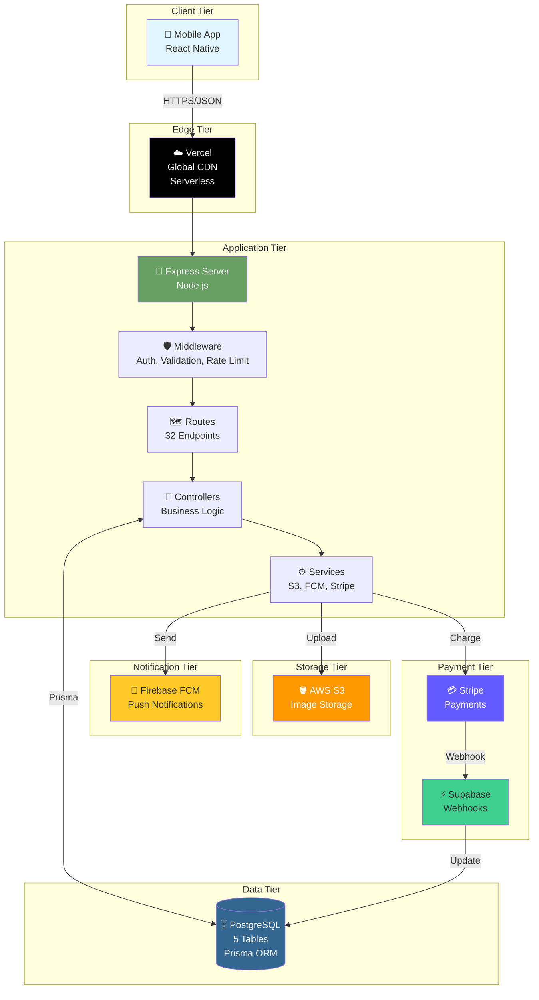

---

## How to Use These Diagrams

### **In Interviews:**

1. **Start with High-Level Architecture**
   - "Let me walk you through the system architecture..."
   - Show overall structure (client → API → database → services)

2. **Explain Request Flow**
   - "When a user creates an activity, here's what happens..."
   - Walk through middleware pipeline → controller → database

3. **Discuss Authentication**
   - "We use JWT-based stateless authentication..."
   - Show signup/login/verification flows

4. **Describe Payment Integration**
   - "Payments are handled asynchronously via webhooks..."
   - Explain Stripe checkout + Supabase webhook handler

5. **Show Database Design**
   - "Our database has 5 main tables with these relationships..."
   - Point out indexes and foreign key cascades

### **In Documentation:**

- Embed these diagrams in your README
- Use in technical design docs
- Include in onboarding materials for new developers

### **For Learning:**

- Study each diagram to understand data flow
- Trace a user action through the system
- Identify bottlenecks and optimization opportunities

---

## Rendering These Diagrams

### **GitHub:**
✅ Renders automatically in `.md` files

### **VS Code:**
1. Install "Markdown Preview Mermaid Support" extension
2. Open markdown file
3. Press `Ctrl+Shift+V` (Windows) or `Cmd+Shift+V` (Mac)

### **Online Editors:**
- [Mermaid Live Editor](https://mermaid.live/)
- [Mermaid Chart](https://www.mermaidchart.com/)

### **Documentation Sites:**
- GitBook (native support)
- Docusaurus (via plugin)
- MkDocs (via plugin)

---

## Key Takeaways from Architecture

1. **Stateless Backend:** JWT tokens, no session storage (scales horizontally)
2. **Serverless Deployment:** Auto-scaling, pay-per-use (cost-effective)
3. **Layered Architecture:** Clear separation of concerns (maintainable)
4. **Async Webhooks:** Stripe webhooks via Supabase Edge Functions (reliable)
5. **Image Optimization:** Sharp preprocessing before S3 upload (performance)
6. **Push Notifications:** Firebase FCM for multi-platform (engagement)
7. **Database Indexes:** Optimized for feed queries (fast)

---

**You can now visualize and explain your entire architecture!** 🚀